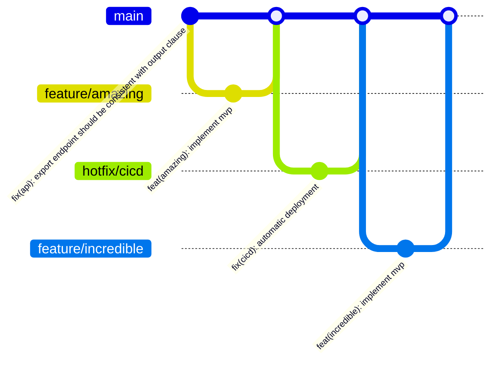

<p align="center">
  
</p>

[](https://standardjs.com)
[](https://github.com/features/security)
[](https://codeql.github.com/)
[](http://commitizen.github.io/cz-cli/)
[](https://semantic-release.gitbook.io/semantic-release/)

# About
`create-evolved` is a versatile project scaffolding CLI built with Plop.js and Node.js to accelerate the bootstrap of modern applications, services, and libraries by generating opinionated, best-practice project structures automatically. It combines interactive prompts, customizable Handlebars templates, and a plugin-style architecture to support a wide range of project types.

# Requirements
Before using `create-evolved`, ensure you have the following installed on your system:
* **git** -- A free and open source distributed version control system designed to handle everything from small to very large projects with speed and efficiency. 
* **dotnet** -- A cross-platform toolchain for developing, building, running, and publishing .NET applications; included with the .NET SDK.
* **pnpm** -- A fast, disk space efficient package manager for JavaScript and Node.js projects, providing strict package management and workspace support.

# Usage

1. **Generate a new project**

```sh
pnpm create evolved@latest
```

2. **Follow the interactive prompts**  
Answer questions about project name, author, license, and optional features

3. **Start coding**  
Navigate to your `directory` and run the usual commands (`pnpm i`, `dotnet restore`) as directed by your chosen template.

# Supported Templates

* **.NET Services (netstandard2.0)**  
Opinionated C# service solution with clean-code architecture.

* **.NET WebAPI (netstandard2.0)**  
Opinionated C# minimal api solution.

# Contributing

We welcome contributions! Contributions are what make the open source community such an amazing place to learn, inspire, and create. Any contributions you make are **greatly appreciated**.

If you have a suggestion that would make this better, please fork the repo, make changes and create a pull request. You can also simply open an issue with the tag "enhancement". Don't forget to give the project a star! Thanks again!

This GitHub repository adheres to the principles of [GitHub Flow](https://docs.github.com/en/get-started/using-github/github-flow) as outlined in the official GitHub documentation. We ensure that all changes are made through branch-based workflows, enabling collaborative development and efficient code review before integration into the main branch.



1. Fork the Project
1. Create your Feature Branch (`git checkout -b feature/amazing`)
1. Commit your Changes (`cz`)
1. Push to the Branch (`git push origin feature/amazing`)
1. Open a Pull Request